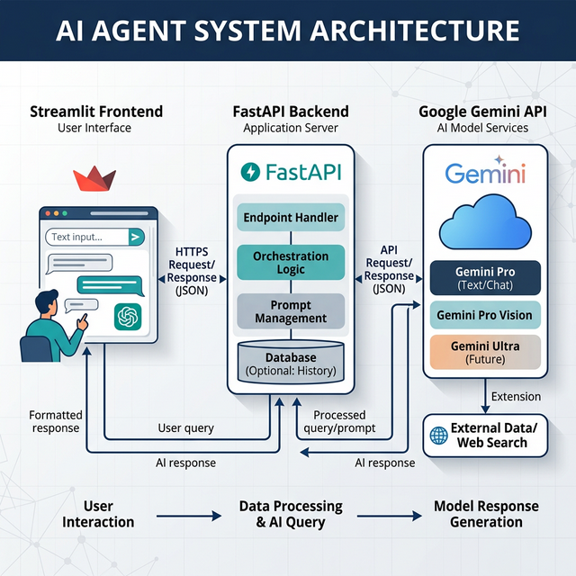

# Athena AI – Your Multimodal AI-Agent powered by Gemini

Athena AI is a real-time full-stack AI assistant that can understand text, voice, and images using Google Gemini models.



## Project Structure
- `backend/`: FastAPI application that interfaces with the Google GenAI SDK.
- `frontend/`: Streamlit web interface for rich, responsive UI.
- `docker/`: Dockerfile and compose for cloud deployment (e.g., Google Cloud Run / Vertex AI).
- `assets/`: App images/logos.
- `architecture.png`: High-level system architecture.

## Requirements
- Python 3.11+
- Google Gemini API Key

## Setup & Run Locally

### 1. Environment Variable
You need an active Google Gemini API Key. Set it in your environment:
```powershell
$env:GEMINI_API_KEY="your-api-key"
```

### 2. Run Backend
```powershell
cd athena-ai-agent
pip install -r backend/requirements.txt
uvicorn backend.main:app --reload --port 8000
```

### 3. Run Frontend (in a separate terminal)
```powershell
cd athena-ai-agent
pip install -r frontend/requirements.txt
# Optional: Set the local backend URL explicitly if not localhost:8000
# $env:BACKEND_URL="http://127.0.0.1:8000" 
streamlit run frontend/app.py
```

## Cloud Deployment (Google Cloud Run / Vertex AI)
Use the included Docker setup to build and deploy to a cloud container registry.
```bash
docker build -f docker/Dockerfile -t athena-ai .
docker run -p 8000:8000 -p 8501:8501 -e GEMINI_API_KEY=$GEMINI_API_KEY athena-ai
```
Or use docker-compose:
```bash
docker-compose -f docker/docker-compose.yml up --build
```
